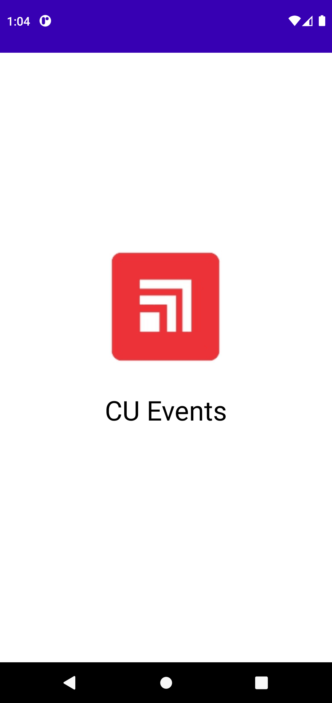
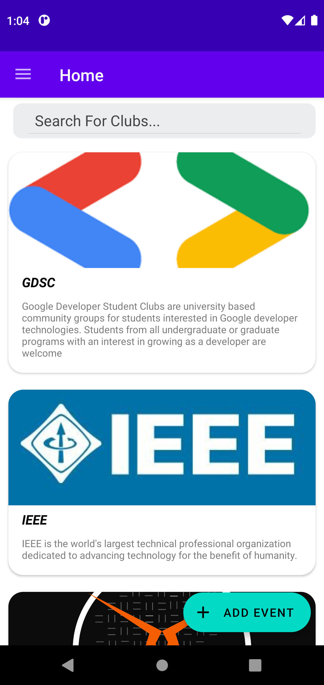
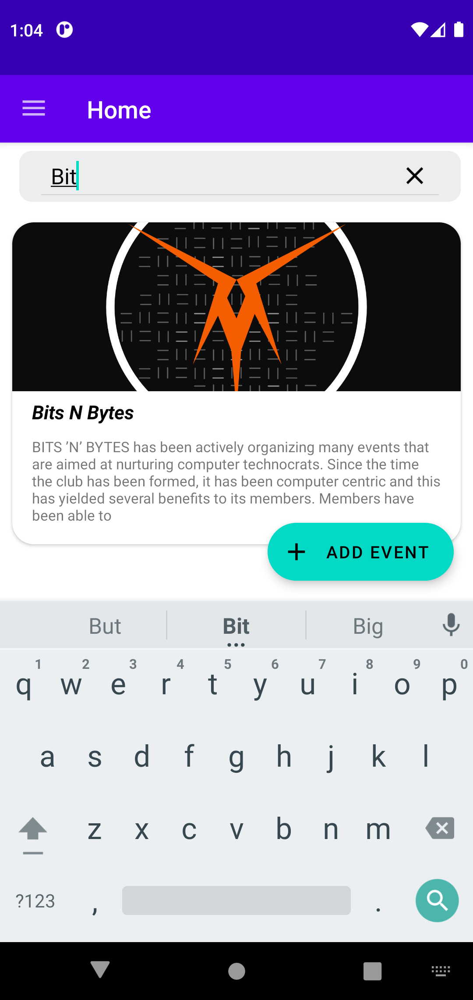
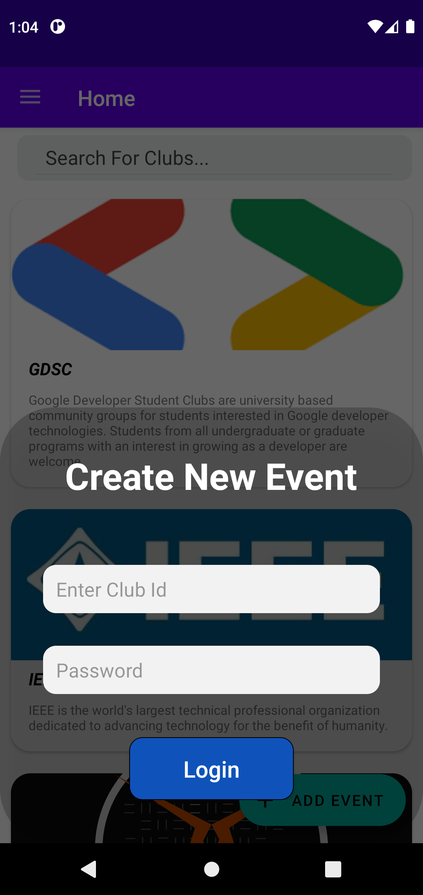
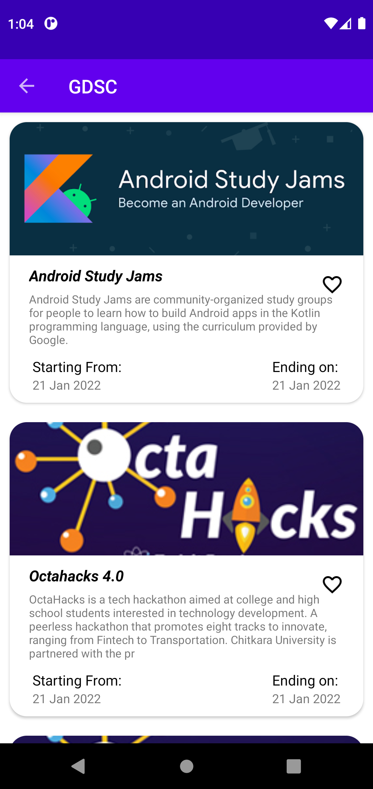
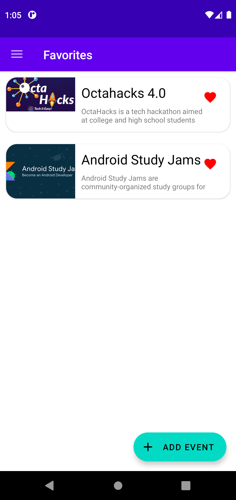
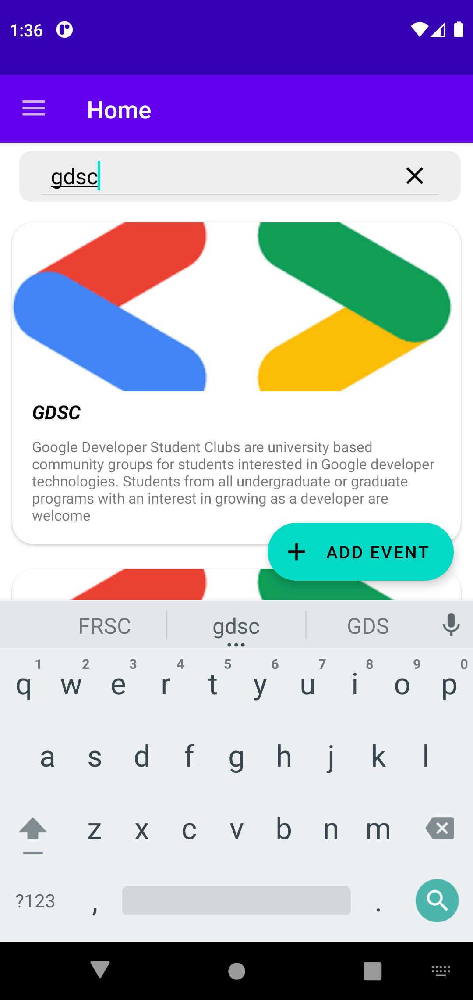
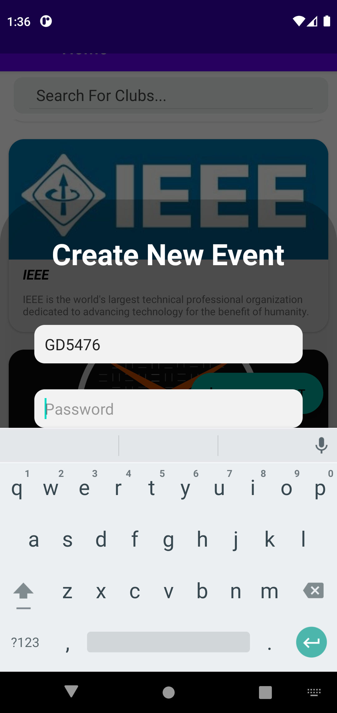

# Android-Study-Jams

CU Events

<b> Problem Statement: </b>

It has been seen that for the most part of their engineering journey students have no idea of technical communities around them just like GDSC, which keeps them away from a ton of opportunities and learning resources.

<b> Proposed Solution : </b>

The app focuses on helping college students getting to know their college’s technical communities better. This application is secure, totally dynamic and only recognised club presidents can add events to it. This is where students will get every opportunity available to them right in one place.
If someone wishes to start a community of their own, this is free marketing for them since all users will be notified of it.

|                                                  |                                                  |                                                  |
| :----------------------------------------------: | :----------------------------------------------: | :----------------------------------------------: |
|  |  |  |
|  |  |  |
|  |  |  |

<b> Functionality & Concepts used : </b>

- BottomSheet Dialogue : Used for creating new events and logging in.

- The App has a very simple and interactive interface which helps the students find all events with ease

- Relative and Liner Layout : The app uses Relative and Liner Layout that makes the design very intuitive

- Simple & Easy Views Design : Use of familiar audience EditText with hints and interactive buttons made it easier for students to register or sign in without providing any detailed instructions pages. Apps also uses App Navigation to switch between different screens.

-Navigation: To navigate between the screens and fragments where we will show our some favorite events

- RecyclerView : To present the list of different clubs we used the efficient recyclerview.

- LiveData & Room Database : We are also using LiveData to update & observe any changes or additions in events of any club.

-Volley : Used to fetch data fron internet using API's

<b> Application Link & Future Scope : </b>

Future scope of the application includes being able to take registrations from within the app itself. You can find the the apk of the application [Here](https://drive.google.com/drive/folders/1hlnASqTwDymcCNgns2uMyqwSBZ8v-fmp?usp=sharing). Something like this application was one of the top requirements by the students of our college as found in a poll. This application is secure, totally dynamic and only recognised club presidents can add events to it.
Authors - Ayush Mishra , Armaan Jain.
